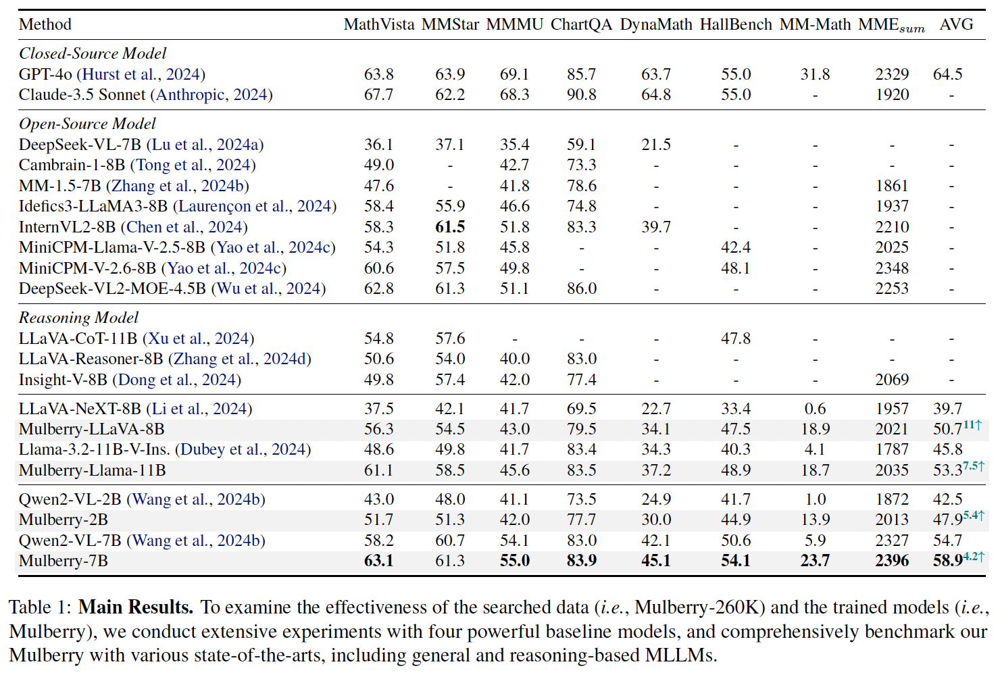

<div align="center">

<h1> Mulberry: Empowering MLLM with o1-like Reasoning and Reflection via Collective Monte Carlo Tree Search </h1>

<h5 align="center"> 

<a href='https://arxiv.org/abs/2412.18319'></a>
<a href='https://huggingface.co/HuanjinYao/Mulberry_llava_8b'>
<!--<a href='https://huggingface.co/collections/HuanjinYao/denseconnector-66500e173fc8c9f05dc98dea'></a>
[](https://zhuanlan.zhihu.com/p/700000183)
<a href='https://huggingface.co/spaces/HuanjinYao/DenseConnector-v1.5-8B'></a>-->


[Huanjin Yao](https://scholar.google.com/citations?user=pDtsCBQAAAAJ&hl=zh-CN)<sup>2,3*</sup>,
[Jiaxing Huang](https://jxhuang0508.github.io/)<sup>1*✉️</sup>,
[Wenhao Wu](https://whwu95.github.io/)<sup>3</sup>,
[Jingyi Zhang]()<sup>1</sup>,
[Yibo Wang]()<sup>2</sup>,
[Shunyu Liu]()<sup>1</sup>,
[Yingjie Wang]()<sup>1</sup>,

[Yuxin Song]()<sup>3</sup>,
[Haocheng Feng]()<sup>3</sup>,
[Li Shen]()<sup>4</sup>,
[Dacheng Tao]()<sup>1</sup>


<sup>1</sup>[Nanyang Technological University](https://www.ntu.edu.sg/), <sup>2</sup>[Tsinghua University](https://www.tsinghua.edu.cn/en/), <sup>3</sup>[Baidu](https://vis.baidu.com/#/), <sup>4</sup>[SYSU](https://www.sysu.edu.cn/sysuen/)

<sup>*</sup>Equal Contribution,       <sup>✉️</sup>Corresponding Author

</h5>
</div>


## News
- [x] **`Jan 08, 2025.`** We release the **CoMCTS code** for searching step-by-step reasoning and reflection data, along with the [**Mulberry-LLaVA-8B**](https://huggingface.co/HuanjinYao/Mulberry_llava_8b) model and its **reasoning inference code**.
- [x] **`Dec 24, 2024.`** We release our paper in [arxiv](https://arxiv.org/abs/2412.18319).

## Reasoning Inference
We provide the inference code for running Mulberry models, which can output detailed step-by-step reasoning.

```bash
python infer.py \
--model 'Mulberry_llava_8b' \
--model_path 'HuanjinYao/Mulberry_llava_8b' \
--question 'Question: <Your_Question>' \
--img_path '<Your_Img_Path>' 
```


<details>
<summary>You can also run the following command if you only require the final answer.</summary>

```bash
python infer.py \
--model 'Mulberry_llava_8b' \
--model_path 'HuanjinYao/Mulberry_llava_8b' \
--question 'Question: <Your_Question>' \
--img_path '<Your_Img_Path>' \
--only_output_final_answer
```

</details>

## 🌲 Data Constrution with CoMCTS
We release **CoMCTS Code** for generating reasoning and reflection data, which leverage collective knowledge from multiple models to collaboratively conjecture, search and identify effective reasoning paths toward correct answers via four iterative operations including Expansion, Simulation and Error Positioning, Backpropagation, and Selection.

Please refer [here](https://github.com/HJYao00/Mulberry/tree/main/comcts) for more details.


## Main Results

We conduct extensive experiments with four powerful baseline models, including [LLaVA-Next-8b](https://huggingface.co/llava-hf/llama3-llava-next-8b-hf), [LLaMA-3.2-Vision-11B-Instruct](https://huggingface.co/meta-llama/Llama-3.2-11B-Vision-Instruct), [Qwen2-VL-2B](https://huggingface.co/Qwen/Qwen2-VL-2B-Instruct) and [Qwen2-VL-7B](https://huggingface.co/Qwen/Qwen2-VL-7B-Instruct). The **Main Results** comparing the Mulberry models with other state-of-the-art models across several popular benchmarks are shown in the figure below.

<div align=center>

</div>

## Quantitative Results
Mulberry creates rich, explicit and well-defined reasoning steps with comprehensive understanding, ultimately arriving at the correct answer.
<div align=center>

</div>

## Citation
If you find this repository is useful, please star🌟 this repo and cite🖇️ our paper.
```bibtex
@article{yao2024mulberry,
  title={Mulberry: Empowering MLLM with o1-like Reasoning and Reflection via Collective Monte Carlo Tree Search},
  author={Yao, Huanjin and Huang, Jiaxing and Wu, Wenhao and Zhang, Jingyi and Wang, Yibo and Liu, Shunyu and Wang, Yingjie and Song, Yuxin and Feng, Haocheng and Shen, Li and Tao, Dacheng},
  journal={arXiv preprint arXiv:2412.18319},
  year={2024}
}
```


## Acknowledgment
Our work is primarily based on the following codebases. We are sincerely grateful for their work.
- [LLaMA-Factory](https://github.com/hiyouga/LLaMA-Factory): We use llama-factory to fine-tune Mulberry Models.
- [VLMEvalKit](https://github.com/open-compass/VLMEvalKit): We use VLMEvalKit for evaluation.

## Limitations
Mulberry is a preliminary exploration work in o1-like MLLM, leveraging Collective Monte Carlo Tree Search to enable effective and efficient reasoning-path searching and learning. 
CoMCTS leverages collective knowledge to significantly improve the search success rate and efficiency of reasoning path searches.
By training on the reasoning data generated through CoMCTS, Mulberry has gained step-by-step reasoning capabilities, leading to a substantial improvement in overall performance.
Nevertheless, certain limitations must be acknowledged.

Hallucinations in intermediate steps: Hallucinations are still prevalent in MLLMs, whether in closed or open-source models.
For instance, the models may generate obvious errors in intermediate reasoning steps yet still arrive at the correct final answer in CoMCTS.
Therefore, although we incorporated multiple models to better detect errors, some errors still persist in the intermediate steps because ensuring the correctness of all intermediate steps often requires human checks, which is extremely costly and unaffordable for us.

Error localization: 
During our experiments, we observed that models struggle to detect their own errors. To address this, CoMCTS employs multiple models to cross-check each other's errors.
However, our findings also revealed that smaller models often fail to generate effective detection responses, while larger models occasionally exhibit inaccurate error localization.
Thus, inaccurate localization may impact the efficiency of the search and we recommend using larger models for error localization or exploring better prompts to enable smaller models to localize errors more accurately.

