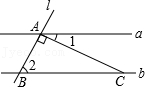
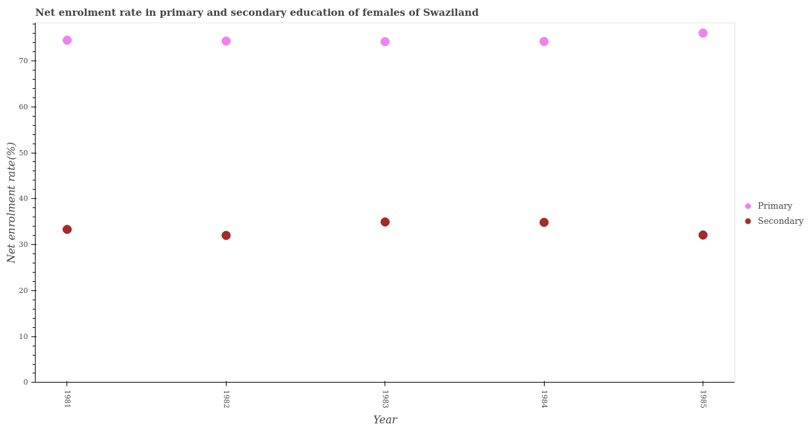

Here, we provide detailed instructions for running CoMCTS, along with illustrative examples of its inputs and outputs.

You can try out CoMCTS reasoning with the data in the [demo_data](https://github.com/HJYao00/Mulberry/tree/main/comcts/demo_data) folder.

## Start Search

Our CoMCTS code now supports reasoning path search using [GPT-4o](https://openai.com/index/hello-gpt-4o/), [LLaMA-3.2-Vision series](https://ai.meta.com/blog/llama-3-2-connect-2024-vision-edge-mobile-devices/), and [Qwen-2-VL series](https://github.com/QwenLM/Qwen2-VL) models. 

```bash
CUDA_VISIBLE_DEVICES='0,1,2,3,4,5,6,7' python code/run_comcts.py \
    --image_dir_path ./demo_data/images \
    --data_path ./demo_data/comcts_input_data.json \
    --output_path ./output/comcts_data.jsonl \
    --max_iterations 20 \
    --gpt_version gpt-4o \
    --openai_api_key "Your_Open_API_Key" \
    --qwen2_vl_7b_model_path 'Qwen/Qwen2-VL-7B-Instruct' \
    --qwen2_vl_72b_model_path 'Qwen/Qwen2-VL-72B-Instruct' \
    --llama3_vision_11b_model_path 'meta-llama/Llama-3.2-11B-Vision-Instruct' 
```


## Input Data Examples

We provide several input samples in the [demo_data](https://github.com/HJYao00/Mulberry/tree/main/comcts/demo_data) folder, randomly selected from the [Geo3k](https://aclanthology.org/2021.acl-long.528.pdf) dataset.


`"image"`: `"image"` is either the absolute path to the image or a path relative to `image_dir_path`.

`"question"`: We recommend extracting the question into the `"question"` first, as the questions in the conversations may include prompts that could affect reasoning searches and influence the results (e.g., phrases like "directly select the answer").

`"conversations"`: We limit the length of `"conversations"` to 2, consisting of one question from the **human** and one response from **GPT**. **GPT's response** is used as the **ground truth** to evaluate whether the reasoning path successfully finds the correct answer.

You need to organize your custom input data following the format below:

```bash
{
    "image": "geo3k/train/74/img_diagram.png",
    "question": "Question: Find x.\nChoices:\nA: 30\nB: 45\nC: 60\nD: 90",
    "conversations": [
        {
            "from": "human",
            "value": "<image>\nBased on the image, directly select the correct answer for the following question:\nQuestion: Find x.\nChoices:\nA: 30\nB: 45\nC: 60\nD: 90"
        },
        {
            "from": "gpt",
            "value": "Answer:B"
        }
    ]
}
```

## Output Examples

Figure 3 provides a qualitative illustration of the entire CoMCTS tree search. Below, we present several output results at the final step from CoMCTS searches. Note the below examples at the final step already included all the previous steps searched by CoMCTS.

<div align=center>

</div>


### Output Example #1

**Output Example #1** illustrates that during CoMCTS search, GPT-4o successfully finds the correct reasoning path with **the highest UCB value**, while the other three models generate incorrect reasoning.
<div align=center>

</div>


```bash
{
        "gpt-4o": {
            "response": "### Image Description:\nThe image shows two pairs of parallel lines: lines a and b are parallel, and lines c and d are parallel. These lines intersect to form a grid-like structure. There are sixteen numbered angles created at the intersections. Angles 1 to 8 are associated with lines a and b, while angles 9 to 16 are associated with lines c and d. The image specifically indicates that the measure of angle 4 is 57 degrees.\n\n### Rationales:\nThe question is asking us to find the measure of angle 5, given that lines a and b are parallel, and lines c and d are parallel, and the measure of angle 4 is 57 degrees. Since the lines are parallel, we can use the properties of parallel lines and angles to determine the measure of angle 5. By identifying the type of angles involved (such as corresponding, alternate interior, or exterior angles), we can calculate the desired angle.\n\n### Let's think step by step.\n### Step 1:\nIdentify the relationship between angles 4 and 5. Since lines a and b are parallel, and c is a transversal intersecting these lines, angle 4 and angle 5 are consecutive interior angles.\n\n### Step 2:\nUse the consecutive interior angles theorem. For two parallel lines cut by a transversal, the sum of consecutive interior angles is 180 degrees. Therefore, m\u22204 + m\u22205 = 180\u00b0.\n\n### Step 3:\nSubstitute the given value for m\u22204 into the equation from Step 2. We have m\u22204 = 57\u00b0.\n\n### Step 4:\nCalculate m\u22205 using the equation m\u22204 + m\u22205 = 180\u00b0. Substitute 57 for m\u22204 and solve for m\u22205: 57\u00b0 + m\u22205 = 180\u00b0.\n\n### Step 5:\nSubtract 57\u00b0 from both sides to find m\u22205: m\u22205 = 180\u00b0 - 57\u00b0.\n\n### Step 6:\nCalculate the final value: m\u22205 = 123\u00b0.\n\n### The final answer is: C",
            "value": 1.65,
            "is_correct": 1,
            "valid": 1
        },
        "qwen2_vl_7b": {
            "response": "### Image Description:\nThe image shows two pairs of parallel lines: lines a and b are parallel, and lines c and d are parallel. These lines intersect to form a grid-like structure. There are sixteen numbered angles created at the intersections. Angles 1 to 8 are associated with lines a and b, while angles 9 to 16 are associated with lines c and d. The image specifically indicates that the measure of angle 4 is 57 degrees.\n\n### Rationales:\nThe question is asking us to find the measure of angle 5, given that lines a and b are parallel, and lines c and d are parallel, and the measure of angle 4 is 57 degrees. Since the lines are parallel, we can use the properties of parallel lines and angles to determine the measure of angle 5. By identifying the type of angles involved (such as corresponding, alternate interior, or exterior angles), we can calculate the desired angle.\n\n### Let's think step by step.\n### Step 1: Identify the type of angles involved.\nSince lines a and b are parallel, and lines c and d are parallel, we can use the properties of corresponding angles, alternate interior angles, and alternate exterior angles to find the measure of angle 5.\n\n### Step 2: Use the properties of parallel lines.\nGiven that lines a and b are parallel, and lines c and d are parallel, we can use the fact that corresponding angles are equal. Therefore, angle 4 is equal to angle 5.\n\n### Step 3: Determine the measure of angle 5.\nSince angle 4 is given as 57 degrees, and angle 4 is equal to angle 5, the measure of angle 5 is also 57 degrees.\n\n### The final answer is: A: 57",
            "value": 0.58,
            "is_correct": -1,
            "valid": 1
        },
        "qwen2_vl_72b": {
            "response": "### Image Description:\nThe image shows two pairs of parallel lines: lines a and b are parallel, and lines c and d are parallel. These lines intersect to form a grid-like structure. There are sixteen numbered angles created at the intersections. Angles 1 to 8 are associated with lines a and b, while angles 9 to 16 are associated with lines c and d. The image specifically indicates that the measure of angle 4 is 57 degrees.\n\n### Rationales:\nThe question is asking us to find the measure of angle 5, given that lines a and b are parallel, and lines c and d are parallel, and the measure of angle 4 is 57 degrees. Since the lines are parallel, we can use the properties of parallel lines and angles to determine the measure of angle 5. By identifying the type of angles involved (such as corresponding, alternate interior, or exterior angles), we can calculate the desired angle.\n\n### Let's think step by step.\n### Step 1:\nIdentify the type of angles involved. Since lines a and b are parallel, and lines c and d are parallel, we can use the properties of parallel lines to determine the relationship between angles 4 and 5.\n\n### Step 2:\nDetermine the measure of angle 5. Since angle 4 and angle 5 are corresponding angles formed by the intersection of parallel lines a and b with a transversal, they are congruent. Therefore, the measure of angle 5 is equal to the measure of angle 4, which is 57 degrees.\n\n### The final answer is: A: 57",
            "value": 0.69,
            "is_correct": -1,
            "valid": 1
        },
        "llama_vision_11b": {
            "response": "### Image Description:\nThe image shows two pairs of parallel lines: lines a and b are parallel, and lines c and d are parallel. These lines intersect to form a grid-like structure. There are sixteen numbered angles created at the intersections. Angles 1 to 8 are associated with lines a and b, while angles 9 to 16 are associated with lines c and d. The image specifically indicates that the measure of angle 4 is 57 degrees.\n\n### Rationales:\nThe question is asking us to find the measure of angle 5, given that lines a and b are parallel, and lines c and d are parallel, and the measure of angle 4 is 57 degrees. Since the lines are parallel, we can use the properties of parallel lines and angles to determine the measure of angle 5. By identifying the type of angles involved (such as corresponding, alternate interior, or exterior angles), we can calculate the desired angle.\n\n### Let's think step by step:\n### Step 1: Identify the type of angle that corresponds to angle 5. Since lines a and b are parallel, angle 5 is a corresponding angle to angle 4.\n\n### Step 2: Recall that corresponding angles are congruent when two parallel lines are cut by a transversal. Therefore, angle 5 is equal in measure to angle 4.\n\n### Step 3: Since the measure of angle 4 is given as 57 degrees, the measure of angle 5 is also 57 degrees.\n\n### The final answer is: A",
            "value": 0.55,
            "is_correct": -1,
            "valid": 1
        },
        "image": "geo3k/train/567/img_diagram.png",
        "question": "Question: In the figure, a \\parallel b, c \\parallel d, and m \\angle 4 = 57. Find the measure of \\angle 5.\nChoices:\nA: 57\nB: 113\nC: 123\nD: 133",
        "prefix_prompt": "### Image Description:\nThe image shows two pairs of parallel lines: lines a and b are parallel, and lines c and d are parallel. These lines intersect to form a grid-like structure. There are sixteen numbered angles created at the intersections. Angles 1 to 8 are associated with lines a and b, while angles 9 to 16 are associated with lines c and d. The image specifically indicates that the measure of angle 4 is 57 degrees.\n\n### Rationales:\nThe question is asking us to find the measure of angle 5, given that lines a and b are parallel, and lines c and d are parallel, and the measure of angle 4 is 57 degrees. Since the lines are parallel, we can use the properties of parallel lines and angles to determine the measure of angle 5. By identifying the type of angles involved (such as corresponding, alternate interior, or exterior angles), we can calculate the desired angle.\n\n",
        "conversations": [
            {
                "from": "human",
                "value": "<image>\nBased on the image, directly select the correct answer for the following question:\nQuestion: In the figure, a \\parallel b, c \\parallel d, and m \\angle 4 = 57. Find the measure of \\angle 5.\nChoices:\nA: 57\nB: 113\nC: 123\nD: 133"
            },
            {
                "from": "gpt",
                "value": "Answer:C"
            }
        ]
    }
```

### Output Example #2
**Output Example #2** demonstrates the **effectiveness** and **efficiency** of CoMCTS. Both Qwen2-VL-7B and Qwen2-VL-72B find the correct answer during the search. However, Qwen2-VL-72B achieves a **higher UCB value** compared to Qwen2-VL-7B because minor errors appear in Qwen2-VL-7B's response.

<div align=center>

</div>

```bash
{
        "gpt-4o": {
            "response": "### Image Description:\nThe image shows a square with a diagonal line drawn from the top left corner to the bottom right corner, creating two right triangles. In one of these triangles, an angle labeled x is opposite the right angle, and the other angle at the top of the diagonal is labeled as 12 degrees. The diagonal is labeled y.\n\n### Rationales:\nThe question asks for the value of x, which is an angle in a right triangle formed within a square. Given that one angle is 12 degrees, x can be determined by knowing that the sum of angles in a triangle is 180 degrees, and one angle in a right triangle is always 90 degrees.\n\n### Let's think step by step.\n### Step 1:\nIdentify that the sum of all angles in a triangle is 180 degrees.\n\n### Step 2:\nNotice that the right angle in the triangle contributes 90 degrees to the total.\n\n### Step 3:\nCalculate the remaining angles: 180 degrees total - 90 degrees (right angle) = 90 degrees for the sum of the other two angles.\n\n### Step 4:\nSubtract the given 12-degree angle from the remaining 90 degrees: 90 degrees - 12 degrees = 78 degrees.\n\n### Step 5:\nAssign the calculated angle value to x.\n\n### The final answer is: D: 90",
            "value": 1.05,
            "is_correct": -1,
            "valid": 1
        },
        "qwen2_vl_7b": {
            "response": "### Image Description: \nThe image shows a square with a diagonal line drawn from one corner to the opposite corner. The length of the diagonal is labeled as 12 units. There is an angle labeled as x\u00b0 and another angle labeled as y\u00b0.\n\n### Rationales:\n- The diagonal of a square divides it into two congruent right-angled triangles.\n- In a right-angled triangle, the angles sum up to 180\u00b0.\n- The diagonal forms the hypotenuse of the right-angled triangle.\n\n### Let's think step by step.\n1. The diagonal of the square divides it into two congruent right-angled triangles.\n2. In each right-angled triangle, the angles sum up to 180\u00b0.\n3. The angle opposite the hypotenuse (the diagonal) is 90\u00b0.\n4. The other two angles are equal because the triangles are congruent.\n5. Let's denote the two equal angles as x\u00b0.\n\n### Step 1:\nSince the two angles are equal and they sum up to 90\u00b0, each angle is 45\u00b0.\n\n### Step 2:\nTherefore, x\u00b0 = 45\u00b0.\n\n### The final answer is: B: 45",
            "value": 1.49,
            "is_correct": 1,
            "valid": 1
        },
        "qwen2_vl_72b": {
            "response": "### Image Description: The image shows a square with a side length of 12 units. A diagonal line divides the square into two right-angled triangles. The angle between the diagonal and one side of the square is labeled as x degrees. The diagonal is labeled as y.\n\n### Rationales: The angle x can be determined by recognizing that the diagonal of a square divides it into two congruent right-angled triangles. The angle between the diagonal and one side of the square is always 45 degrees.\n\n### Let's think step by step.\n### Step 1: Identify the shape and its properties.\nThe shape in the image is a square. A square has four equal sides and four right angles.\n\n### Step 2: Understand the relationship between the diagonal and the sides.\nThe diagonal of a square divides it into two congruent right-angled triangles. In each of these triangles, the diagonal is the hypotenuse, and the sides of the square are the legs.\n\n### Step 3: Determine the angle between the diagonal and one side of the square.\nIn a right-angled triangle, the angle between the hypotenuse and one of the legs is always 45 degrees. Therefore, the angle x between the diagonal and one side of the square is 45 degrees.\n\n### The final answer is: B: 45",
            "value": 1.65,
            "is_correct": 1,
            "valid": 1
        },
        "llama_vision_11b": {
            "valid": -1,
            "response": "### Image Description: \nA geometric diagram showing a square with a diagonal line dividing it into two right-angled triangles. The top-right corner of the square is labeled \"x\" and the bottom-left corner is labeled \"y\". The side length of the square is given as 12 units.\n\n### Rationales:\nSince the square has equal sides, all sides are 12 units long. When a diagonal is drawn in a square, it divides the square into two congruent right-angled triangles. The angle at the corner labeled \"x\" is one of these angles in one of these triangles.\n\n### Let's think step by step.\nTo find angle x, we can use the fact that the sum of the interior angles of a triangle is always 180 degrees. In a right-angled triangle, one angle is 90 degrees (the right angle), so the sum of the other two angles must be 90 degrees as well.\n\nSince the two triangles created by the diagonal are congruent, the angles at \"x\" and \"y\" are equal. Let's call this common angle \"a\". Therefore, we have:\n\na + a = 90 (since the sum of the interior angles in a triangle is 180)\n\nCombine like terms:\n\n2a = 90\n\nDivide both sides by 2:\n\na = 45\n\nSo, angle x (which is equal to angle y) is 45 degrees.\n\n### The final answer is: B: 45"
        },
        "image": "geo3k/train/74/img_diagram.png",
        "question": "Question: Find x.\nChoices:\nA: 30\nB: 45\nC: 60\nD: 90",
        "prefix_prompt": "",
        "conversations": [
            {
                "from": "human",
                "value": "<image>\nBased on the image, directly select the correct answer for the following question:\nQuestion: Find x.\nChoices:\nA: 30\nB: 45\nC: 60\nD: 90"
            },
            {
                "from": "gpt",
                "value": "Answer:B"
            }
        ]
    }
```


### Output Example #3

**Output Example #3** shows that through collective search, Qwen2-VL-7B ultimately identified the correct reasoning path.

<div align=center>

</div>


```bash
{
        "gpt-4o": {
            "valid": -1,
            "response": "### Image Description:\nThe image depicts two parallel horizontal lines labeled as 'a' and 'b'. A diagonal line 'l' intersects these parallel lines at points labeled A (on line 'a') and B (on line 'b'). Additionally, a perpendicular line from point A intersects line 'b' at point C, forming a right angle at A. There is an indicated angle labeled '1' between line 'l' and the perpendicular line at point A, measuring 32\u00b0. Another angle labeled '2' is formed between line 'l' and line 'b' at point B.\n\n### Rationales:\nThe situation involves understanding the properties of parallel lines and transversals. Line 'l' acts as a transversal intersecting the parallel lines 'a' and 'b', leading to angle relationships described by corresponding angles and alternate interior angles. We use these angle relationships to determine the degree measure of the unknown angle (angle 2).\n\n### Let's think step by step.\n### Step 1:\nIdentify that line 'a' is parallel to line 'b'. Therefore, the angles formed by a transversal (line 'l') intersecting these lines are related. Particularly, angle 1 and angle 2 are alternate interior angles due to the parallel lines.\n\n### Step 2:\nSince angle 1 is given as 32\u00b0, and it serves as an alternate interior angle to angle 2, these angles are equal when lines are parallel. Thus, angle 2 also measures 32\u00b0.\n\n### The final answer is: A: 32\u00b0"
        },
        "qwen2_vl_7b": {
            "response": "### Image Description:\nThe image depicts two parallel horizontal lines labeled as 'a' and 'b'. A diagonal line 'l' intersects these parallel lines at points labeled A (on line 'a') and B (on line 'b'). Additionally, a perpendicular line from point A intersects line 'b' at point C, forming a right angle at A. There is an indicated angle labeled '1' between line 'l' and the perpendicular line at point A, measuring 32\u00b0. Another angle labeled '2' is formed between line 'l' and line 'b' at point B.\n\n### Rationales:\n1. Since line 'a' is parallel to line 'b', the corresponding angles formed by the transversal line 'l' are equal.\n2. The perpendicular line from point A to line 'b' at point C creates a right angle at A, making angle 1 = 90\u00b0 - angle 2.\n3. The sum of angles on a straight line is 180\u00b0.\n\n### Let's think step by step.\n1. Given angle 1 = 32\u00b0, we can find angle 2 by using the property of parallel lines and transversals.\n2. Since angle 1 is part of a right angle at point A, angle 2 = 90\u00b0 - angle 1.\n3. Substituting the given value, angle 2 = 90\u00b0 - 32\u00b0 = 58\u00b0.\n\n### Step 1:\nIdentify the given angle 1 = 32\u00b0.\n\n### Step 2:\nUse the property of parallel lines and transversals to find angle 2.\n\n### Step 3:\nCalculate angle 2 = 90\u00b0 - angle 1 = 90\u00b0 - 32\u00b0 = 58\u00b0.\n\n### The final answer is: 58\u00b0.",
            "value": 1.384,
            "is_correct": 1,
            "valid": 1
        },
        "qwen2_vl_72b": {
            "response": "### Image Description:\nThe image depicts two parallel horizontal lines labeled as 'a' and 'b'. A diagonal line 'l' intersects these parallel lines at points labeled A (on line 'a') and B (on line 'b'). Additionally, a perpendicular line from point A intersects line 'b' at point C, forming a right angle at A. There is an indicated angle labeled '1' between line 'l' and the perpendicular line at point A, measuring 32\u00b0. Another angle labeled '2' is formed between line 'l' and line 'b' at point B.\n\n### Rationales:\nThe problem involves understanding the relationships between angles formed by intersecting lines and parallel lines. The given information includes the parallel lines 'a' and 'b', the perpendicular line from point A to line 'b', and the measure of angle 1. The goal is to find the measure of angle 2.\n\n### Let's think step by step.\n### Step 1:\nIdentify the given information:\n- Line 'a' is parallel to line 'b'.\n- A perpendicular line from point A intersects line 'b' at point C.\n- Angle 1 measures 32\u00b0.\n\n### Step 2:\nUnderstand the properties of parallel lines and transversals:\n- When a transversal intersects two parallel lines, corresponding angles are equal.\n- The sum of the angles on a straight line is 180\u00b0.\n\n### Step 3:\nDetermine the relationship between angle 1 and angle 2:\n- Since line 'a' is parallel to line 'b', angle 1 and angle 2 are corresponding angles.\n- Therefore, angle 2 is equal to angle 1.\n\n### Step 4:\nCalculate the measure of angle 2:\n- Angle 1 measures 32\u00b0.\n- Therefore, angle 2 also measures 32\u00b0.\n\n### The final answer is: A: 32\u00b0",
            "value": 0.851,
            "is_correct": -1,
            "valid": 1
        },
        "llama_vision_11b": {
            "valid": -1,
            "response": "### Image Description:\nThe image depicts two parallel horizontal lines labeled as 'a' and 'b'. A diagonal line 'l' intersects these parallel lines at points labeled A (on line 'a') and B (on line 'b'). Additionally, a perpendicular line from point A intersects line 'b' at point C, forming a right angle at A. There is an indicated angle labeled '1' between line 'l' and the perpendicular line at point A, measuring 32\u00b0. Another angle labeled '2' is formed between line 'l' and line 'b' at point B.\n\n### Rationales:\nGiven that line 'l' is parallel to line 'b', corresponding angles are equal. Therefore, the measure of angle 1 is equal to the measure of the corresponding angle on line 'b', which is also 32\u00b0.\n\nSince the line from point A to point C is perpendicular to line 'b', the angle at A with line 'b' (angle 2) and the angle at A with the perpendicular line are complementary angles. The sum of the measures of two complementary angles is always 90\u00b0.\n\n### Step 1:\nThe sum of the measures of two complementary angles is 90\u00b0. Let's denote the measure of angle 2 as x. Therefore, 32\u00b0 + x = 90\u00b0.\n\n### Step 2:\nSolving for x, we get x = 90\u00b0 - 32\u00b0 = 58\u00b0.\n\n### The final answer is:: 58\u00b0"
        },
        "image": "geoqa_plus/10756.png",
        "question": "Question: In the provided diagram, it is known that line l intersects lines a and b at points A and B respectively, and line a is parallel to line b. Additionally, the perpendicular line passing through point A intersects line b at point C. If angle 1 measures 32\u00b0, what is the degree measure of angle 2?\nChoices:\nA: 32\u00b0\nB: 68\u00b0\nC: 58\u00b0\nD: 34\u00b0",
        "prefix_prompt": "### Image Description:\nThe image depicts two parallel horizontal lines labeled as 'a' and 'b'. A diagonal line 'l' intersects these parallel lines at points labeled A (on line 'a') and B (on line 'b'). Additionally, a perpendicular line from point A intersects line 'b' at point C, forming a right angle at A. There is an indicated angle labeled '1' between line 'l' and the perpendicular line at point A, measuring 32\u00b0. Another angle labeled '2' is formed between line 'l' and line 'b' at point B.\n\n",
        "conversations": [
            {
                "from": "human",
                "value": "<image>\nFirst perform reasoning, then finally select the question from the choices in the following format: Answer: xxx.\nQuestion: In the provided diagram, it is known that line l intersects lines a and b at points A and B respectively, and line a is parallel to line b. Additionally, the perpendicular line passing through point A intersects line b at point C. If angle 1 measures 32\u00b0, what is the degree measure of angle 2?\nChoices:\nA: 32\u00b0\nB: 68\u00b0\nC: 58\u00b0\nD: 34\u00b0"
            },
            {
                "from": "gpt",
                "value": "Since line a || b, therefore angle 2 + angle BAC + angle 1 = 180\u00b0. Since AC perpendicular  BA, therefore angle BAC = 90\u00b0. Therefore, angle 2 = 180\u00b0 - angle 1 - angle BAC = 180\u00b0 - 90\u00b0 - 32\u00b0 = 58\u00b0. Therefore, the answer is: C.\nAnswer:C"
            }
        ]
    }
```


### Output Example #4


To enable faster reasoning on relatively simple problems, you can use a smaller ensemble of models for search (e.g., GPT-4o and Qwen2-VL-7B), as the 72B model has a slower inference speed.

**Output example #4** demonstrates that smaller models can deduce the correct answer while **GPT-4o makes errors**. This highlights the importance of collective knowledge in reasoning and search, showing that leveraging collective insights can imporve the search success rate.

<div align=center>

</div>

```bash
{
        "gpt-4o": {
            "response": "### Image Description:\nThe image is a scatter plot showing the net enrollment rate in primary and secondary education for females in Swaziland from 1981 to 1985. The x-axis represents the years, while the y-axis represents the net enrollment rate in percentage. Pink dots represent primary education enrollment rates, and brown dots represent secondary education enrollment rates. The primary education enrollment data points are consistently higher than the secondary education ones across the years.\n\n### Rationales:\nThe question asks for the enrollment rate in primary education in 1985, which means we need to focus on the data point corresponding to the year 1985 for primary education. We must differentiate primary education from secondary education on the plot.\n\n### Let's think step by step.\n\n### Step 1:\nIdentify the color representing primary education enrollment on the plot, which is pink.\n\n### Step 2:\nLocate the pink dot that corresponds to the year 1985 on the x-axis.\n\n### The final answer is: 75%",
            "value": 1.622,
            "is_correct": -1,
            "valid": 1
        },
        "qwen2_vl_7b": {
            "response": "### Image Description:\nThe image is a scatter plot showing the net enrollment rate in primary and secondary education for females in Swaziland from 1981 to 1985. The x-axis represents the years, while the y-axis represents the net enrollment rate in percentage. Pink dots represent primary education enrollment rates, and brown dots represent secondary education enrollment rates. The primary education enrollment data points are consistently higher than the secondary education ones across the years.\n\n### Rationales:\nThe question asks for the enrollment rate in primary education in 1985, which means we need to focus on the data point corresponding to the year 1985 for primary education. We must differentiate primary education from secondary education on the plot.\n\n### Let's think step by step.\n\n### Step 1:\nIdentify the color representing primary education enrollment on the plot, which is pink.\n\n### Step 2:\nLocate the pink dot that corresponds to the year 1985 on the x-axis.\n\n### Step 3:\nObserve the y-axis value for the pink dot at the year 1985.\n\n### Step 4:\nThe y-axis value for the pink dot at the year 1985 is approximately 76%.\n\n### The final answer is: The enrollment rate in primary education in 1985 was approximately 76%.",
            "value": 1.651,
            "is_correct": 1,
            "valid": 1
        },
        "image": "plotqa/plotqa_00000365.png",
        "question": "Question: What is the enrollment rate in primary education in 1985?\nYour answer should be very brief.",
        "prefix_prompt": "### Image Description:\nThe image is a scatter plot showing the net enrollment rate in primary and secondary education for females in Swaziland from 1981 to 1985. The x-axis represents the years, while the y-axis represents the net enrollment rate in percentage. Pink dots represent primary education enrollment rates, and brown dots represent secondary education enrollment rates. The primary education enrollment data points are consistently higher than the secondary education ones across the years.\n\n### Rationales:\nThe question asks for the enrollment rate in primary education in 1985, which means we need to focus on the data point corresponding to the year 1985 for primary education. We must differentiate primary education from secondary education on the plot.\n\n### Let's think step by step.\n\n### Step 1:\nIdentify the color representing primary education enrollment on the plot, which is pink.\n\n### Step 2:\nLocate the pink dot that corresponds to the year 1985 on the x-axis.\n\n",
        "conversations": [
            {
                "role": "human",
                "value": "What is the enrollment rate in primary education in 1985?\nYour answer should be very brief."
            },
            {
                "role": "gpt",
                "value": "76.06."
            }
        ]
    }
```
